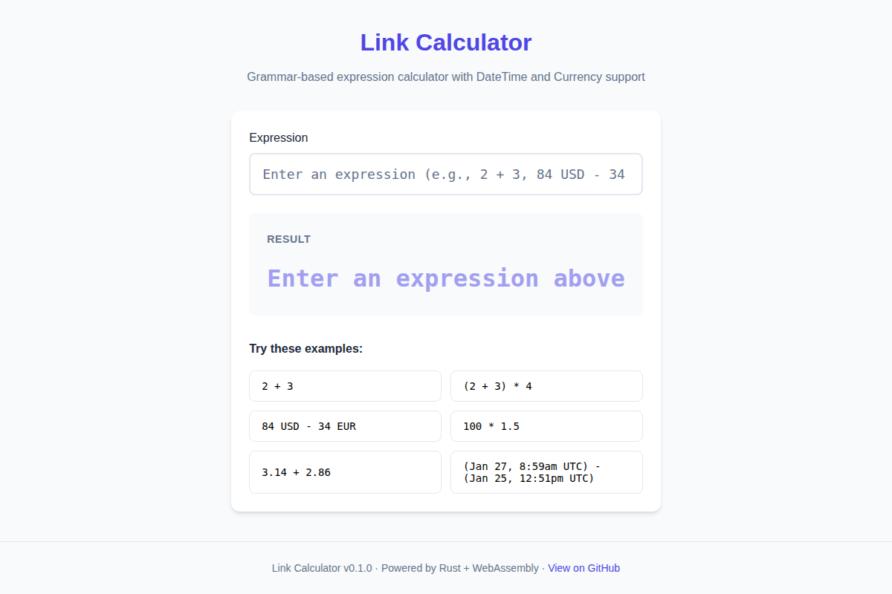
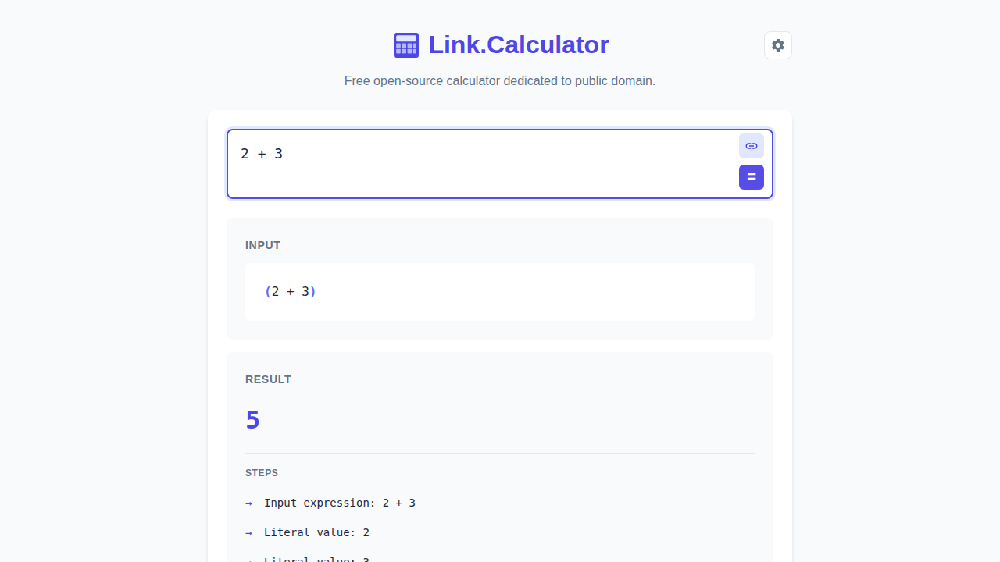
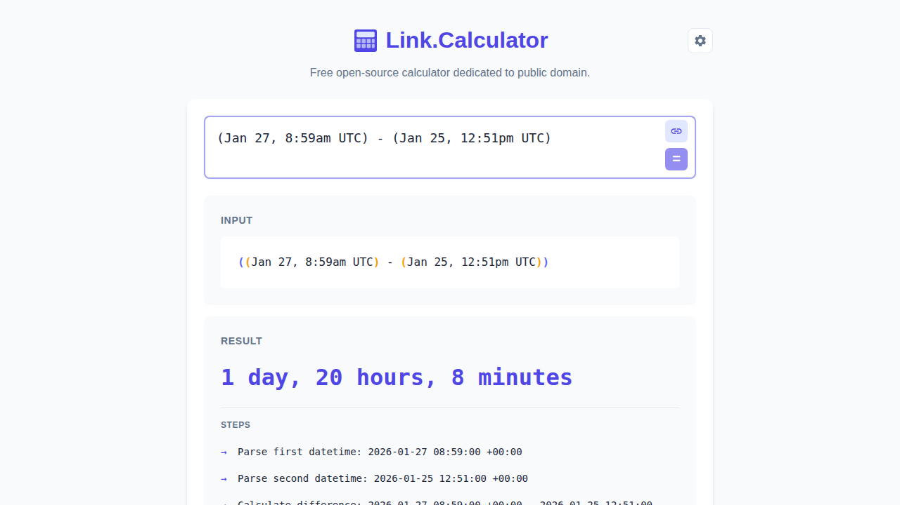
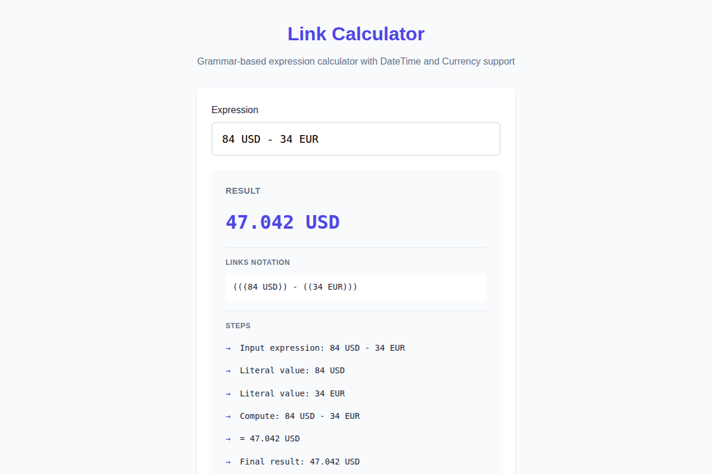

# Link Calculator

A grammar-based expression calculator with DateTime and Currency support, built with Rust WebAssembly and React.

[](https://github.com/link-assistant/calculator/actions)
[](https://link-assistant.github.io/calculator/)
[](https://www.rust-lang.org/)
[](http://unlicense.org/)

## Live Demo

**[https://link-assistant.github.io/calculator/](https://link-assistant.github.io/calculator/)**

## Screenshots

### Main Interface


### Arithmetic Operations


### DateTime Calculations


### Currency Conversions


> **📖 See [USE-CASES.md](docs/USE-CASES.md) for more detailed examples with screenshots**, including symbolic integration, math functions, dark theme, and more.

## Features

### Expression Parser
- Arithmetic operations: `+`, `-`, `*`, `/` with proper operator precedence
- Parentheses for grouping: `(2 + 3) * 4`
- Negative numbers: `-5 + 3`
- Decimal precision using `rust_decimal`

### DateTime Support
Supports multiple date and time formats:
- ISO format: `2026-01-22`
- US format: `01/22/2026`
- European format: `22/01/2026`
- Month names: `Jan 22, 2026`, `22 Jan 2026`
- Time formats: `8:59am`, `14:30`, with timezone support (`8:59am UTC`)
- DateTime arithmetic: `(Jan 27, 8:59am UTC) - (Jan 25, 12:51pm UTC)`

### Currency Support
- Currency amounts: `84 USD`, `34 EUR`
- Currency arithmetic with automatic conversion: `100 USD + 50 EUR`
- Temporal awareness: `84 USD - 34 EUR at 22 Jan 2026`
- Support for 50+ currencies including major world currencies, precious metals, and cryptocurrencies

### Links Notation
All expressions are represented in [links-notation](https://github.com/link-foundation/links-notation) format:
- Step-by-step calculation explanations
- Issue prefill links for unrecognized input

## Example Usage

```
> 2 + 3
Result: 5
Links notation: ((2) + (3))

> (Jan 27, 8:59am UTC) - (Jan 25, 12:51pm UTC)
Result: 1 day, 20 hours, 8 minutes
Links notation: (((Jan 27, 8:59am UTC) - (Jan 25, 12:51pm UTC)))

> 84 USD - 34 EUR
Result: 47.042 USD
Links notation: (((84 USD)) - ((34 EUR)))
```

## Technical Implementation

### Rust WASM Core (`src/`)
- `grammar/` - Lexer and recursive descent parser
- `types/` - Value, Decimal, DateTime, Currency, Unit types
- `lino/` - Links notation representation
- `error/` - Error types with thiserror
- `wasm.rs` - WebAssembly bindings

### React Frontend (`web/`)
- Vite + TypeScript + React 18
- Web Worker for non-blocking WASM calculations
- Responsive design with real-time results
- Example expressions for quick testing

### CI/CD (`.github/workflows/`)
- `ci.yml` - Tests, linting, formatting, WASM build
- `deploy.yml` - GitHub Pages deployment

## Development Setup

### Prerequisites
- Rust 1.70+ with `wasm32-unknown-unknown` target
- Node.js 18+
- wasm-pack

### Build & Run

```bash
# Clone the repository
git clone https://github.com/link-assistant/calculator.git
cd calculator

# Build the WASM package
wasm-pack build --target web --out-dir web/public/pkg

# Install web dependencies
cd web
npm install

# Start development server
npm run dev
```

### Running Tests

```bash
# Run all Rust tests
cargo test

# Run tests with verbose output
cargo test --verbose

# Run Clippy lints
cargo clippy --all-targets --all-features

# Format code
cargo fmt

# Check formatting (CI style)
cargo fmt --check
```

### Building for Production

```bash
# Build optimized WASM
wasm-pack build --target web --release --out-dir web/public/pkg

# Build web frontend
cd web
npm run build
```

## Project Structure

```
.
├── .github/workflows/      # CI/CD pipeline configuration
├── data/                   # Currency exchange rate databases
│   └── exchange_rates/     # Historical exchange rates (.lino files)
├── docs/                   # Documentation and screenshots
├── src/                    # Rust source code
│   ├── grammar/            # Lexer, parser, and grammar modules
│   ├── types/              # Core types (Value, DateTime, Currency, etc.)
│   ├── lino/               # Links notation module
│   ├── error.rs            # Error types
│   ├── lib.rs              # Library entry point
│   ├── main.rs             # CLI entry point
│   └── wasm.rs             # WASM bindings
├── tests/                  # Integration tests
├── web/                    # React frontend
│   ├── src/                # TypeScript source
│   └── public/             # Static assets
├── Cargo.toml              # Rust project configuration
└── README.md               # This file
```

## Contributing

Contributions are welcome! Please see [CONTRIBUTING.md](CONTRIBUTING.md) for guidelines.

### Development Workflow

1. Fork the repository
2. Create a feature branch: `git checkout -b feature/my-feature`
3. Make your changes and add tests
4. Run quality checks: `cargo fmt && cargo clippy && cargo test`
5. Add a changelog fragment
6. Commit your changes (pre-commit hooks will run automatically)
7. Push and create a Pull Request

## License

[Unlicense](LICENSE) - Public Domain

This is free and unencumbered software released into the public domain. See [LICENSE](LICENSE) for details.

## Acknowledgments

- Built with [Rust](https://www.rust-lang.org/) and [WebAssembly](https://webassembly.org/)
- Inspired by [links-notation](https://github.com/link-foundation/links-notation)
- React frontend powered by [Vite](https://vitejs.dev/)
