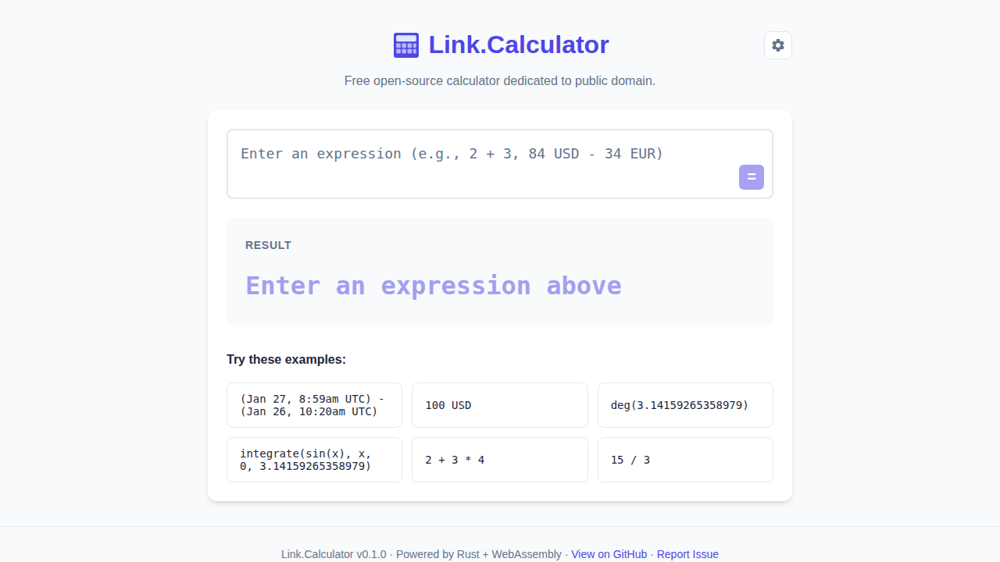
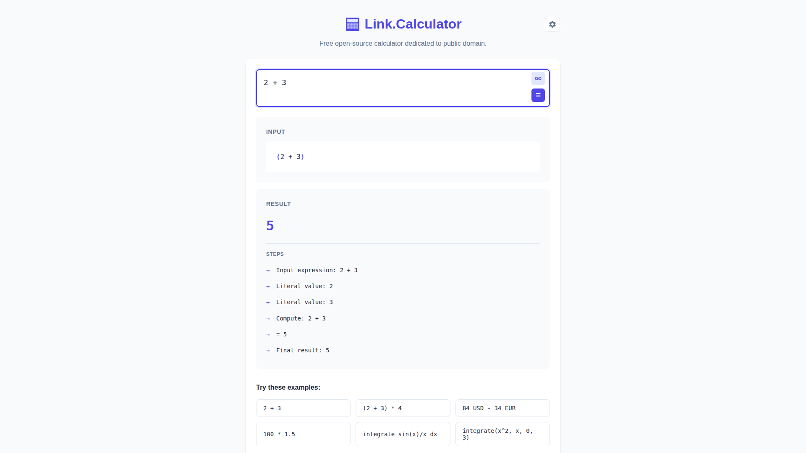
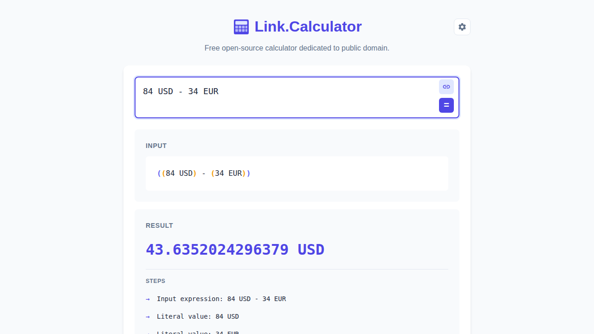
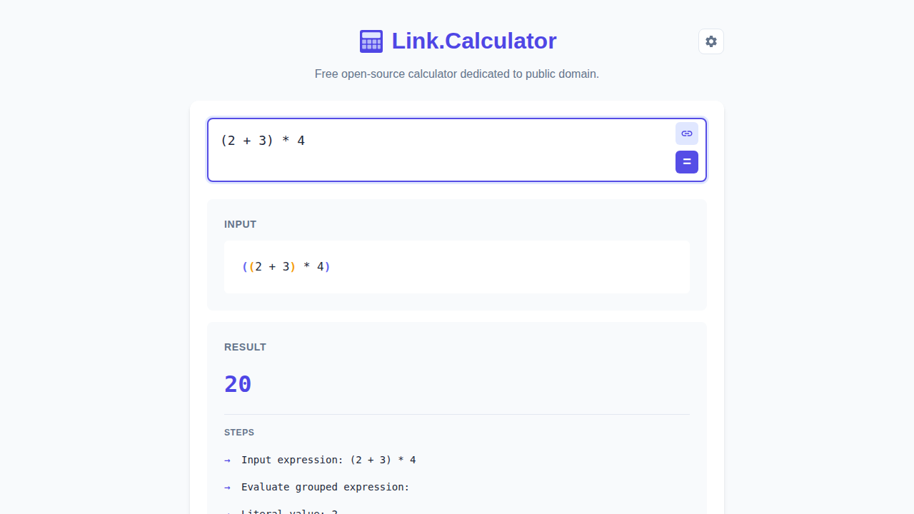
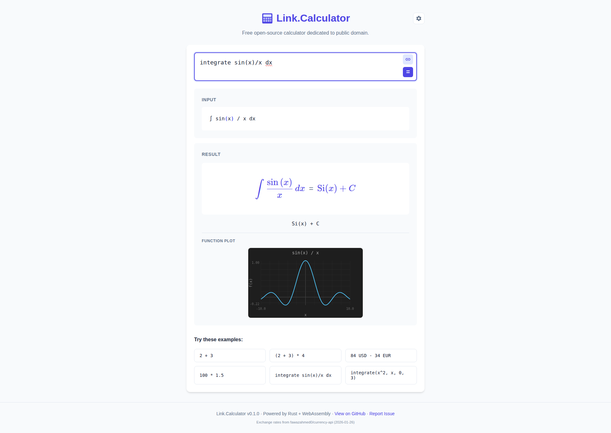
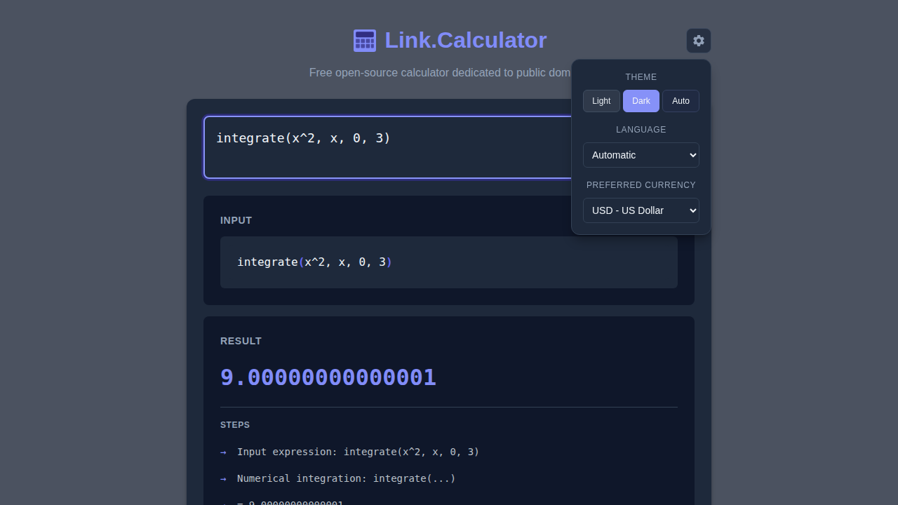
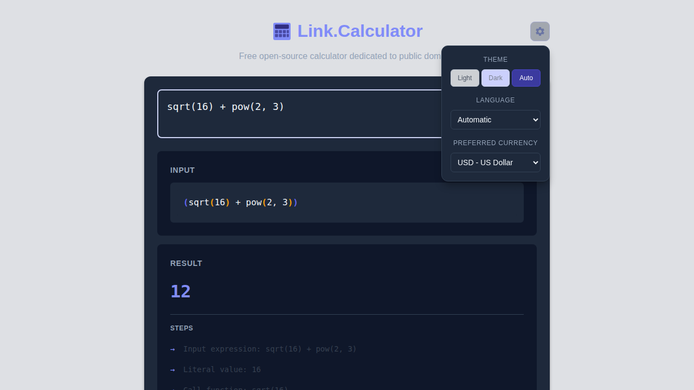
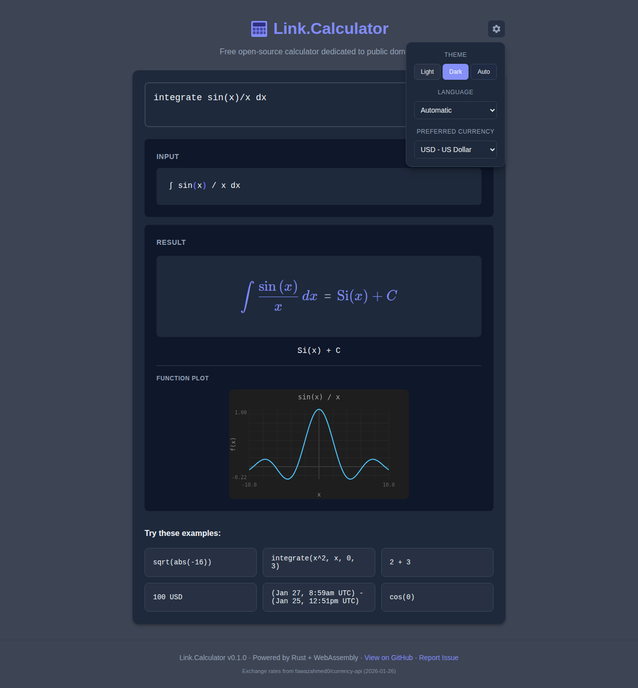

# Link.Calculator Use Cases

This document showcases the various capabilities of Link.Calculator with screenshots and direct links to try each example.

## Table of Contents

- [Initial State](#initial-state)
- [Simple Arithmetic](#simple-arithmetic)
- [Currency Conversion](#currency-conversion)
- [DateTime Calculations](#datetime-calculations)
- [Parentheses Grouping](#parentheses-grouping)
- [Symbolic Integration](#symbolic-integration)
- [Definite Integrals](#definite-integrals)
- [Math Functions](#math-functions)
- [Dark Theme](#dark-theme)

---

## Initial State

The calculator starts with a clean interface, ready to accept your expressions. Six example buttons are shown to help you get started.

[Try it live](https://link-assistant.github.io/calculator/)

---

## Simple Arithmetic

Basic arithmetic operations with step-by-step explanation.

**Expression:** `2 + 3`

[Try this example](https://link-assistant.github.io/calculator/?q=KGV4cHJlc3Npb24lMjAlMjIyJTIwJTJCJTIwMyUyMik%3D)

**Features shown:**
- Basic addition
- Step-by-step calculation breakdown
- Links Notation input interpretation

---

## Currency Conversion

Convert between currencies with real-time exchange rates.

**Expression:** `84 USD - 34 EUR`

[Try this example](https://link-assistant.github.io/calculator/?q=KGV4cHJlc3Npb24lMjAlMjI4NCUyMFVTRCUyMC0lMjAzNCUyMEVVUiUyMik%3D)

**Features shown:**
- Multi-currency arithmetic
- Real-time exchange rate display
- Source and date of exchange rate data
- Automatic currency conversion

---

## DateTime Calculations

Calculate time differences between dates and times.

**Expression:** `(Jan 27, 8:59am UTC) - (Jan 25, 12:51pm UTC)`

[Try this example](https://link-assistant.github.io/calculator/?q=KGV4cHJlc3Npb24lMjAlMjIoSmFuJTIwMjclMkMlMjA4JTNBNTlhbSUyMFVUQyklMjAtJTIwKEphbiUyMDI1JTJDJTIwMTIlM0E1MXBtJTIwVVRDKSUyMik%3D)

**Features shown:**
- DateTime parsing with multiple formats
- Time difference calculation
- Duration display in human-readable format
- Step-by-step breakdown

---

## Parentheses Grouping

Control operator precedence with parentheses.

**Expression:** `(2 + 3) * 4`

[Try this example](https://link-assistant.github.io/calculator/?q=KGV4cHJlc3Npb24lMjAlMjIoMiUyMCUyQiUyMDMpJTIwKiUyMDQlMjIp)

**Features shown:**
- Parentheses for grouping operations
- Correct operator precedence
- Step-by-step breakdown

---

## Symbolic Integration

Compute indefinite integrals with mathematical notation output.

**Expression:** `integrate sin(x)/x dx`

[Try this example](https://link-assistant.github.io/calculator/?q=KGV4cHJlc3Npb24lMjAlMjJpbnRlZ3JhdGUlMjBzaW4oeCklMkZ4JTIwZHglMjIp)

**Features shown:**
- Natural notation for integrals
- LaTeX-rendered mathematical output
- Function plot visualization
- Symbolic result (Si(x) + C)

---

## Definite Integrals

Compute definite integrals with numeric bounds.

**Expression:** `integrate(x^2, x, 0, 3)`

[Try this example](https://link-assistant.github.io/calculator/?q=KGV4cHJlc3Npb24lMjAlMjJpbnRlZ3JhdGUoeCU1RTIlMkMlMjB4JTJDJTIwMCUyQyUyMDMpJTIyKQ%3D%3D)

**Features shown:**
- Definite integral syntax: `integrate(expression, variable, lower, upper)`
- Numerical result
- Step-by-step breakdown

---

## Math Functions

Use built-in mathematical functions.

**Expression:** `sqrt(16) + pow(2, 3)`

[Try this example](https://link-assistant.github.io/calculator/?q=KGV4cHJlc3Npb24lMjAlMjJzcXJ0KDE2KSUyMCUyQiUyMHBvdygyJTJDJTIwMyklMjIp)

**Features shown:**
- Square root function: `sqrt()`
- Power function: `pow(base, exponent)`
- Function call breakdown in steps
- Combination of multiple functions

**Available functions:**
- Trigonometric: `sin()`, `cos()`, `tan()`, `asin()`, `acos()`, `atan()`
- Exponential: `exp()`, `ln()`, `log()`
- Power: `sqrt()`, `pow()`, `abs()`
- Rounding: `floor()`, `ceil()`, `round()`
- Constants: `pi()`, `e()`
- Comparison: `min()`, `max()`
- Other: `factorial()`

---

## Dark Theme

Switch to dark mode for comfortable viewing in low-light environments.

**Features shown:**
- Dark theme toggle in settings
- Language selector
- Preferred currency selector
- Consistent styling across all components

---

## More Examples

Try these additional expressions:

| Category | Expression | Description |
|----------|------------|-------------|
| Arithmetic | `(2 + 3) * 4` | Parentheses for grouping |
| Arithmetic | `2^3` | Power operator |
| Currency | `100 USD in EUR` | Currency conversion |
| Currency | `$100 + €50` | Currency symbols |
| DateTime | `(Jan 27, 8:59am UTC) - (Jan 25, 12:51pm UTC)` | Time difference |
| Functions | `sin(pi()/2)` | Trigonometric functions |
| Functions | `ln(e())` | Natural logarithm |
| Integration | `integrate cos(x) dx` | Indefinite integral |

---

## Getting Started

1. Visit [Link.Calculator](https://link-assistant.github.io/calculator/)
2. Type an expression in the input field
3. Press **Enter** or click the **=** button to calculate
4. View the result and step-by-step breakdown

**Tips:**
- Click any example button to quickly try it
- Use the **Copy Link** button to share your calculation
- Switch themes and languages in the settings menu
- Report issues using the "Report Issue" link in the footer
