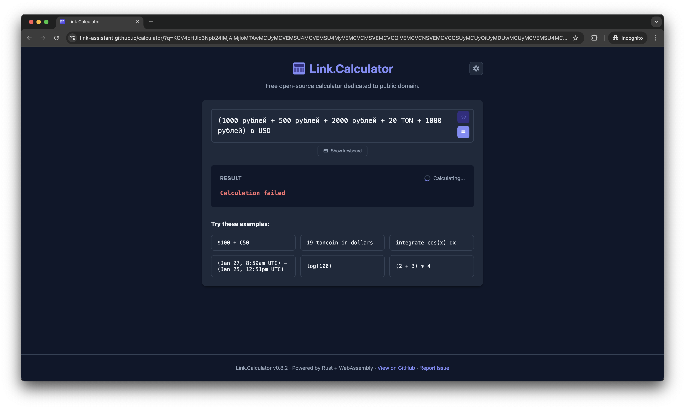

# Case Study: Issue #111 — "Calculation failed" Flash on URL-Loaded Expressions

## Summary

When opening a calculator URL containing a currency expression (e.g., converting
rubles and TON to USD), users briefly see "Calculation failed" for a split second
before the actual result appears. This provides a poor user experience and
contradicts the plan-execute architecture introduced in PR #101, which was
designed to show a busy indicator while rates load.

## Reproduction

**URL:**
```
https://link-assistant.github.io/calculator/?q=KGV4cHJlc3Npb24lMjAlMjIoMTAwMC...
```

**Decoded expression:**
```
(1000 рублей + 500 рублей + 2000 рублей + 20 TON + 1000 рублей) в USD
```

**Steps to reproduce:**
1. Open the URL above in a browser (or any URL with a currency expression)
2. Observe the result section during the first ~1-2 seconds of page load

**Observed behavior:** "Calculation failed" error message flashes briefly,
sometimes alongside the "Calculating..." spinner.

**Expected behavior:** Only the busy indicator (spinner + "Calculating...") should
be shown while rates are being fetched and the calculation is in progress.

## Screenshot



The screenshot shows both "Calculation failed" error AND "Calculating..." spinner
displayed simultaneously — a clear visual contradiction.

## Timeline / Sequence of Events

1. **Page load**: URL contains `?q=...` with a base64-encoded expression.
2. **`useUrlExpression` hook** decodes the expression and sets
   `loadedFromUrl = true`.
3. **Worker initializes WASM** → sends `ready` message → `wasmReady = true`.
4. **Auto-calculate `useEffect`** (App.tsx:272-281) fires:
   - `wasmReady && input.trim() && wasLoadedFromUrl()` is true
   - No cached result exists (first visit)
   - Calls `calculate(input)` → sets `loading = true`
   - Posts `{ type: 'calculate', expression }` to worker
5. **Worker receives `calculate`** → calls `executeCalculation()`:
   - **Step 1 — Plan**: `calculator.plan(expression)` runs instantly (Rust AST
     parsing), returns plan with `success: true`, `lino_interpretation`, and
     `required_sources: ['ecb', 'cbr', 'crypto']`
   - Sends `{ type: 'plan', data: plan }` back to main thread
6. **Main thread receives `plan` message** (App.tsx:187-208):
   - Plan has `success: true` and `lino_interpretation`, so enters the handler
   - `prev` (previous result) is `null` — this is the first load
   - **BUG**: Creates fallback base: `{ result: '', steps: [], success: false }`
   - Spreads plan fields onto base → result becomes
     `{ result: '', steps: [], success: false, lino_interpretation: '...' }`
   - Calls `setResult(...)` with this object
7. **React re-renders**:
   - `result` exists (truthy) → enters result rendering branch
   - `result.success` is `false` → enters error branch
   - Renders `translateError(t, undefined, undefined)` → shows
     `t('errors.calculationFailed')` = **"Calculation failed"**
   - Meanwhile `showLoading` is `true` (after 300ms delay) → spinner also shows
8. **Worker fetches rates** (ECB, CBR, Crypto) — takes 1-2 seconds
9. **Worker executes calculation** → sends `{ type: 'result', data: { success: true, ... } }`
10. **Main thread receives `result`** → `setResult(data)` with real result →
    error disappears, correct result shown

## Root Cause Analysis

The root cause is in the **plan message handler** in `App.tsx` (line 195-198).

When the plan message arrives and there is no previous result (`prev === null`),
the handler creates a fallback base object with `success: false`:

```typescript
const base = prev || {
  result: '',
  steps: [],
  success: false,  // ← BUG: this causes error rendering
};
```

This was intended as a "neutral" placeholder, but `success: false` triggers the
error rendering path in the result section. The plan itself succeeded — only the
final calculation result hasn't arrived yet.

### Why this wasn't caught earlier

- **With cached results**: When a cached result exists (return visit), `prev` is
  the cached result which has `success: true`, so the fallback base is never used.
- **Without URL loading**: When the user types an expression and clicks `=`, the
  result is `null` until the full result arrives. The plan message sets a result,
  but the calculation completes so fast (pure math, no rates needed) that the
  flash is imperceptible.
- **The timing window**: The bug is only visible when rates need to be fetched
  (1-2 second delay), AND it's the first visit (no cache), AND the expression
  was loaded from URL (auto-calculate on page load).

### Contributing factors

1. **Delayed loading indicator**: `useDelayedLoading(loading, 300)` means the
   spinner only appears after 300ms. If the plan arrives within this window,
   the user sees "Calculation failed" with no spinner at all.

2. **No guard against rendering errors while loading**: The render logic at
   line 621 only checks `result ?` — it doesn't distinguish between a real
   failed result and a temporary placeholder from the plan handler.

## Solution

Two fixes applied:

### Fix 1: Plan handler base object (root cause)

Changed the fallback base from `success: false` to `success: true`:

```typescript
const base = prev || {
  result: '',
  steps: [],
  success: true,  // ← Plan succeeded; not an error state
};
```

This ensures the interpretation section renders correctly and no error message
is shown. The empty `result: ''` is displayed as-is (effectively blank) while
the actual calculation runs.

### Fix 2: Render guard (safety net)

Added a condition to prevent error display while loading:

```typescript
// Before:
) : result ? (
// After:
) : result && (result.success || !loading) ? (
```

This ensures that even if some future code path sets a failed result while
loading is in progress, the error won't be shown. Instead, the placeholder
("Enter an expression above") is displayed, which is a much better UX than
a misleading error message.

### Test added

A new test `'should NOT show "Calculation failed" when plan arrives before result (issue #111)'`
verifies that when a plan message arrives without a prior result, no error
elements are rendered.

## Architectural Context

This bug is a residual issue from the **plan→execute architecture** introduced
in PR #101. That PR correctly solved the original problem (calculation failing
because rates weren't loaded) by making the worker wait for rates before
executing. However, the plan message handler in the UI created a side effect:
setting a temporary result with `success: false` that the render logic
interpreted as a real error.

The plan→execute pipeline works correctly in the worker:
```
plan(expr) → send plan to UI → fetch rates → execute(expr) → send result to UI
```

The bug was purely in the **UI layer's handling of the plan message**, not in
the pipeline itself.

## Related Issues and PRs

- **Issue #100**: Original "No exchange rate available" error on URL-loaded
  expressions (fixed by PR #101)
- **PR #101**: Introduced plan→execute architecture with on-demand rate loading
- **Issue #102**: Redundant ECB source in calculation plan (related optimization)
