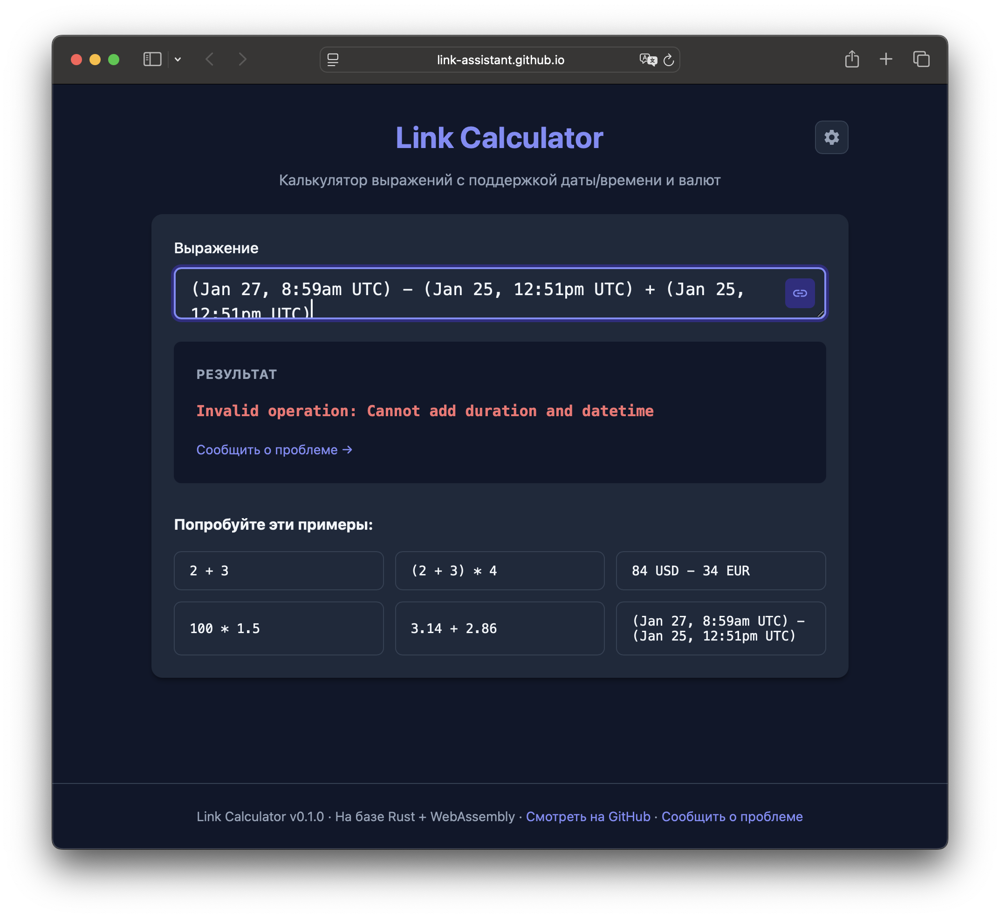

# Case Study: Issue #12 - Textarea Resize Constraints

## Problem Statement

The multiline textarea input field in the Link Calculator allows users to resize it in a way that the content does not fit vertically, causing partial line visibility and poor user experience.

### Key Issues Identified

1. **Content overflow on manual resize**: Users can resize the textarea to a height smaller than required to display all content
2. **Partial line visibility**: Resizing can result in lines being cut off partially, showing only a fraction of text lines
3. **No auto-grow on content change**: When content becomes multiline through typing, the textarea doesn't automatically expand

## Screenshot Analysis



The screenshot shows:
- A multiline expression in the textarea
- The textarea has been manually resized to a very small height
- The text content is visibly cut off (only shows about 1 line of a 2-line expression)
- The resize handle is visible in the bottom-right corner

## Root Cause Analysis

### Current Implementation (index.css:265-283)

```css
.input-wrapper textarea {
  width: 100%;
  min-height: 56px;
  max-height: 200px;
  padding: 1rem;
  padding-right: 3rem;
  font-size: 1rem;
  font-family: 'SF Mono', 'Fira Code', 'Consolas', monospace;
  border: 2px solid var(--border);
  border-radius: 8px;
  background: var(--surface);
  color: var(--text);
  transition: border-color 0.2s, box-shadow 0.2s;
  resize: vertical;          /* Allows unrestricted vertical resize */
  overflow-y: auto;
  word-wrap: break-word;
  white-space: pre-wrap;
  line-height: 1.5;
}
```

### Root Causes

1. **`resize: vertical`** allows users to resize the textarea to any height within min/max bounds, regardless of content
2. **No JavaScript height management** to automatically adjust height based on content
3. **No constraint on resize steps** to ensure heights are always multiples of line-height
4. **Static min-height** doesn't adapt when content exceeds the minimum

## Requirements from Issue

1. **Auto-resize on content change**: When content goes multiline, textarea should automatically expand to minimum height that fits all content
2. **Discrete resize steps**: Manual resize should snap to multiples of line-height, preventing partial line visibility
3. **Minimum height enforcement**: Cannot resize smaller than content requires

## Existing Solutions Research

### 1. react-textarea-autosize (Most Popular)

- GitHub: https://github.com/Andarist/react-textarea-autosize
- npm: https://www.npmjs.com/package/react-textarea-autosize
- Over 1500 dependents
- Automatically grows with content
- **Limitation**: Does not provide discrete step resizing or manual resize constraint

### 2. CSS field-sizing (Modern)

```css
textarea {
  field-sizing: content;
}
```
- **Limitation**: Not supported in Safari or Firefox

### 3. CSS Grid Trick

Described in [CSS-Tricks](https://css-tricks.com/the-cleanest-trick-for-autogrowing-textareas/)
- Uses a hidden element to mirror content
- Works without JavaScript
- **Limitation**: Does not handle manual resize constraints

### 4. Custom JavaScript Hook

A custom React hook can:
1. Monitor content changes
2. Calculate required height based on scrollHeight
3. Handle resize observer to enforce constraints

## Proposed Solution

### Custom AutoResizeTextarea Component

Implement a dedicated React component that:

1. **Auto-grows on content change**:
   - Use `scrollHeight` to determine required height
   - Update height dynamically as user types

2. **Constrains manual resize to discrete line-height steps**:
   - Listen to `ResizeObserver` events
   - Calculate line-height from computed styles
   - Round height to nearest line-height multiple
   - Enforce minimum content height

3. **Maintains smooth UX**:
   - Debounce resize calculations
   - Prevent visual jumping
   - Maintain consistent padding

### Key Implementation Points

```typescript
// Calculate content-based minimum height
const calculateMinHeight = () => {
  const textarea = ref.current;
  if (!textarea) return;

  // Temporarily reset height to measure scrollHeight
  textarea.style.height = 'auto';
  const scrollHeight = textarea.scrollHeight;

  // Calculate lines needed
  const lineHeight = parseFloat(getComputedStyle(textarea).lineHeight);
  const padding = parseFloat(getComputedStyle(textarea).paddingTop)
                + parseFloat(getComputedStyle(textarea).paddingBottom);

  // Round up to next line
  const contentLines = Math.ceil((scrollHeight - padding) / lineHeight);
  const newHeight = (contentLines * lineHeight) + padding;

  textarea.style.height = `${newHeight}px`;
};

// Constrain resize to discrete steps
const constrainResize = (height: number) => {
  const lineHeight = parseFloat(getComputedStyle(textarea).lineHeight);
  const padding = parseFloat(getComputedStyle(textarea).paddingTop)
                + parseFloat(getComputedStyle(textarea).paddingBottom);

  // Calculate content minimum
  const minContentHeight = calculateMinHeight();

  // Round to line-height steps
  const lines = Math.max(1, Math.round((height - padding) / lineHeight));
  const snappedHeight = Math.max(
    minContentHeight,
    (lines * lineHeight) + padding
  );

  return snappedHeight;
};
```

## Testing Strategy

### Unit Tests (Vitest)

1. Test height calculation functions
2. Test line-height snap logic
3. Test minimum height enforcement

### E2E Tests (Playwright)

1. Verify auto-resize on typing multiline content
2. Verify resize drag snaps to line-height multiples
3. Verify cannot resize smaller than content requires
4. Verify proper behavior across different content lengths

## References

- [CSS-Tricks: Auto-Growing Inputs & Textareas](https://css-tricks.com/auto-growing-inputs-textareas/)
- [CSS-Tricks: The Cleanest Trick for Autogrowing Textareas](https://css-tricks.com/the-cleanest-trick-for-autogrowing-textareas/)
- [MDN: CSS resize property](https://developer.mozilla.org/en-US/docs/Web/CSS/resize)
- [Material UI: Textarea Autosize](https://mui.com/material-ui/react-textarea-autosize/)
- [react-textarea-autosize GitHub](https://github.com/Andarist/react-textarea-autosize)

## Timeline

- **2025-01-25**: Issue reported with screenshot
- **2025-01-25**: Investigation and solution implementation started
