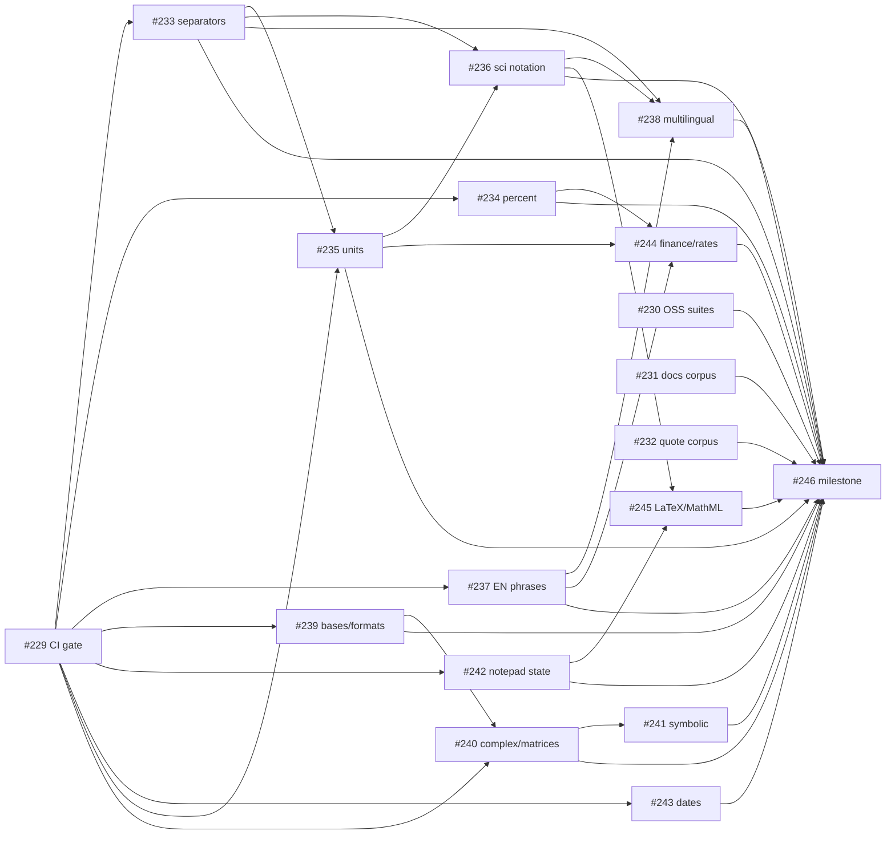

# Issue 227 case study: parity with every calculator for natural-language math

Research and measurements were done on 2026-10-07 against link-calculator
v0.22.0 (`target/release/link-calculator`). The issue body was read in full
(`issue.json`); it had no comments. Companion files:

| File | Content |
| --- | --- |
| [competitor-inventory.md](competitor-inventory.md) | Every engine and product checked, the artifact imported, revision, license, measured coverage, and the reusable components evaluated |
| [natural-language-corpus.md](natural-language-corpus.md) | The multilingual scientific-quote corpus: groups, sources, failure causes, conventions |
| [corpus/](corpus/) | Three executable TSV corpora (3055 rows) |
| [results/coverage-report.md](results/coverage-report.md) | Generated report: per-source and per-language tables plus every `different` and `unsupported` row with the actual output |
| [results/coverage-baseline.json](results/coverage-baseline.json) | Compact per-row status used by the regression gate |
| [sub-issues/](sub-issues/) | The 18 sub-issue specifications exactly as filed, and `issues.json` with numbers, ids and blockers |

## Requirements from the issue

| ID | Requirement (issue text) | Resolution |
| --- | --- | --- |
| R1 | Quotes from scientific papers in natural language, in different languages, must be usable as computable math expressions. | Seeded a 162-row, 13-language corpus of verbatim Wikipedia fragments, theorems in words and paper phrasing ([natural-language-corpus.md](natural-language-corpus.md)). Measured: 10 of 162 rows pass. Gaps are mapped to sub-issues #233, #235, #236, #237, #238, #245 and corpus growth to #232. |
| R2 | At least all compute features of all open-source competitors, based on their tests and code. | Imported 2550 single-expression assertions from the fend, libqalculate, Numbat, Rink and math.js test suites with `scripts/import-competitor-corpus.mjs`. Measured coverage 20.2% (575/2550). Engines without imported suites are listed in the inventory and tracked by #230. |
| R3 | At least all compute features of all closed-source competitors, based on their documentation. | 266 verbatim Soulver documentation examples plus 77 examples from Numi, Wolfram\|Alpha, Google, Calca, Raycast, Apple Math Notes and Frink. Measured coverage 16.0% (55/343). Completion of the documentation corpus is #231. |
| R4 | Automated scripts that check exactly what we have and what is missing. | `scripts/competitor-coverage.mjs` evaluates every corpus row through the CLI, writes the report, and fails on regressions against a baseline. `scripts/competitor-coverage.test.mjs` runs in the existing `node --test scripts/*.test.mjs` CI step. Running it in CI with a scheduled gap report is #229. |
| R5 | Plan all required work as sub-issues of #227 with dependencies marked as blockers. | 18 sub-issues (#229 to #246) were created from the specifications in `sub-issues/`, attached with the GitHub sub-issues API, and every "Blocked by" relation was registered with the issue-dependencies API (37 edges). See the dependency graph below. |
| R6 | The result is a pull request with the deep analysis and all issues created. | PR #228 carries this case study, the scripts, the corpora and the measured report. |
| R7 | Collect the data in `docs/case-studies/issue-227`, search online for additional facts, list every requirement, propose solution options and plans per requirement, and check existing components and libraries. | This directory. Online sources: upstream repositories (revisions in the inventory), Soulver documentation (`documentation.soulver.app/llms.txt` index), Wikipedia REST summaries in 13 languages, crates.io metadata for 17 crates, and the Duckling, Recognizers-Text, text2num, quantulum3, MathCAT, Speech Rule Engine and Mathics repositories. Options and component decisions are in each sub-issue and summarized below. |

## Method

1. Clone each open-source competitor into an isolated directory and extract
   single-expression assertions from its test suite (`import-competitor-corpus.mjs`).
   Multi-statement programs and tests that depend on prior state are skipped.
2. Fetch documentation pages of closed-source products and extract
   `expression | answer` pairs verbatim (`experiments/issue-227/extract-soulver-examples.mjs`).
3. Take numeric sentences from Wikipedia science articles in 13 languages and
   write theorem and paper-phrasing rows by hand with expected values.
4. Run every row through the one-shot CLI (`link-calculator "<expression>"`,
   5 s timeout, 24 s total) and classify it:
   `supported` (result matches the expected display value at the expected
   precision), `different` (evaluated to another value), `unsupported`
   (error), `timeout`.
5. Group every failure by error class and by competitor feature, and turn each
   group into a sub-issue with evidence, acceptance criteria, options and blockers.

Reproduce:

```sh
cargo build --release --bin link-calculator
node scripts/competitor-coverage.mjs --baseline docs/case-studies/issue-227/results/coverage-baseline.json
node --test scripts/competitor-coverage.test.mjs
```

## Measured state (3055 rows)

| Source | Rows | Supported | Different | Unsupported |
| --- | ---: | ---: | ---: | ---: |
| fend | 1098 | 369 (33.6%) | 67 | 662 |
| Qalculate! | 656 | 61 (9.3%) | 14 | 581 |
| math.js | 297 | 80 (26.9%) | 22 | 195 |
| Numbat | 289 | 65 (22.5%) | 22 | 202 |
| Rink | 210 | 0 (0.0%) | 33 | 177 |
| Soulver | 266 | 25 (9.4%) | 32 | 209 |
| Numi, Wolfram\|Alpha, Google, Calca, Raycast, Apple, Frink | 77 | 30 (39.0%) | 3 | 44 |
| Wikipedia quotes, derived, theorems, paper phrasing | 162 | 10 (6.2%) | 20 | 132 |
| **All** | **3055** | **640 (20.9%)** | **213** | **2202** |

Languages: en 21.6% (2942 rows); de 7.1%, fr 7.7%, zh 7.7%, ru 5.3%; es, hi,
it, ja, ko, pt, tr, ar 0%. No row timed out.

### Silent wrong answers (the most important finding)

`different` rows are more dangerous than `unsupported` rows because the user
gets a number. The main families, each with a verbatim example:

| Family | Example | Expected | Actual | Sub-issue |
| --- | --- | --- | --- | --- |
| Thousands separators | `3,000 minus 12` | 2,988 | -9 | #233 |
| Percent arithmetic | `200 + 10%` | 220 | 200.1 | #234 |
| `m` is milli or minutes | `10m × 10m` | 100 m² | 0.0001 | #235 |
| Unit algebra ignored | `2 amperes times 5 ohms` | 10 V | 10 amperes | #235 |
| Unknown words become units | `3 squared plus 4 squared` | 25 | `7 squared` | #237 |
| CJK absorbed as unit | `3的平方加4的平方` | 25 | `3 的平方加4的平方` | #238 |
| Base prefixes | `0xff` | 255 | `0 XFF` | #239 |
| `mod` sign | `mod(-1, 4)` | 3 | -1 | #240 |
| Clock difference sign | `5pm - 7pm` | 2 hours | -2 hours | #243 |
| Rate times duration | `30 fps × 3 minutes` | 5,400 frames | 90 FPS | #244 |
| `log … base` ignored | `log 20 base 4` | 2.161 | 5.204 | #237 |

### Error classes of the 2202 unsupported rows

| Class | Rows | Top triggers |
| --- | ---: | --- |
| Unexpected identifier | 524 | `infinity` 78, `not` 30, `nan` 23, `true` 17, `kg` 15, `false` 12, `fib` 12, `the` 9, `la` 8, `days`/`day` 14, `vat` 7, `what` 6, `atanh` 5, `meter` 5 |
| Unexpected character | 500 | `[` 104, `°` 60, `"` 49, `#` 49, `'` 47, `~` 40, `;` 35, `\|` 34, `&` 24, `.` 23, `@` 17, `±`, `⁄`, `¼`, `‰` |
| Trailing input | 274 | second number after a unit (`5 feet 10 inches`), `,`, `!`, `/`, `?`, `of`, `and`, `what`, `million`, `billion`, `ago`, `year` |
| Undefined variable | 232 | `x` 143 (Qalculate! algebra), `i` 43 (complex), `m` 30 (metre) |
| Unexpected token | 188 | operator forms the token parser does not know |
| Expected a unit name after as/in/to | 88 | `to fraction`, `to 2 dp`, `is what %` |
| Unit or conversion error | 62 | `Unknown unit 'decimal'/'fraction'/'timespan'`, `No exchange rate available` |
| Display conversions | 77 | `to roman` 30, `to words` 18, `to eng` 17, `to float` 8, `to hex` 4 |
| Solver limits | 25 | only polynomial equations with one unknown |
| Unknown function or arity | 50 | `fac`, `atanh`, `cis`, `identity`, `matrix`, `vector`, `gcd`; `min` with more than two arguments; `round` with two arguments |
| Datetime | 30 | `time in Paris`, `yesterday`, `Cannot add datetime and number` |

## Sub-issues and dependency graph

All 18 are attached to #227 as sub-issues; arrows are registered GitHub
"blocked by" dependencies (the arrow points from the blocker to the blocked
issue).

| # | Title | Blocked by |
| --- | --- | --- |
| #229 | Run the competitor coverage checker in CI and fail on regressions | none |
| #230 | Keep the imported open-source test suites current and add the missing engines | none |
| #231 | Complete the closed-source calculator documentation corpus | none |
| #232 | Grow the multilingual scientific-quote corpus beyond the 13 seeded languages | none |
| #233 | Thousands separators and locale decimal commas give silently wrong answers | #229 |
| #234 | Percent arithmetic differs from every competitor | #229 |
| #235 | General dimensional unit algebra: length, temperature, electrical and compound units | #229, #233 |
| #236 | Scientific notation as written in papers: superscripts, SI prefixes, ± uncertainty, scale words | #233, #235 |
| #237 | English noun-phrase operators: squared, cubed, sum of, half of, dozen, rounded, log base | #229 |
| #238 | Multilingual phrase operators, spelled numbers and CJK tokenization | #237, #233, #236 |
| #239 | Number bases, bitwise operators, repeating decimals and display formats | #229 |
| #240 | Complex numbers, vectors and matrices, infinity/NaN and missing special functions | #229, #239 |
| #241 | Symbolic algebra: variables in expressions, non-polynomial equations, calculus | #240 |
| #242 | Notepad state: variables, line references, totals, booleans, strings, comments, conditionals | #229 |
| #243 | Date and time parity: sign conventions, natural display, IANA/city zones, relative dates, workdays, timecode | #229 |
| #244 | Finance, statistics and rate phrases | #234, #235, #237 |
| #245 | Accept LaTeX, MathML and Unicode math notation copied from papers | #236, #242 |
| #246 | Milestone: every corpus row is supported or has a documented difference | #230 to #245 |



Suggested order: #229 first (one day of CI work, unblocks everything), then the
two silent-wrong-answer fixes #233 and #234, then #235 (the largest, needed by
the scientific-quote requirement), then #237 and #236 together, then #238 for
the languages. #239 to #243 are independent of the units work and can proceed
in parallel. #244 and #245 close the long tail; #246 is the acceptance gate.

## Solution options per requirement

| Requirement | Options considered | Chosen direction |
| --- | --- | --- |
| R1 multilingual scientific quotes | (a) grow the LINO vocabulary with phrase links per language and longest-match segmentation; (b) port text2num tables and Recognizers-Text YAML into LINO data with a generator; (c) depend on Duckling or a tagger service | (a) with (b) as data source; (c) rejected because it is not embeddable in Rust/WASM. Sub-issues #236, #237, #238, #245. |
| R2 open-source parity | (a) import upstream tests as executable corpus and implement natively; (b) embed `fend-core`/`rink-core`/`libqalculate` as backends | (a); (b) only as test oracles, because a second parser would bypass LINO output, the datetime grammar and the licensing constraints (GPL for libqalculate). Sub-issues #230, #233 to #243. |
| R3 closed-source parity | (a) verbatim documentation examples as corpus; (b) hand-written feature matrix | (a), Soulver documentation as the primary specification. Sub-issues #231, #234, #243, #244. |
| R4 automated gap checking | (a) Node runner over the CLI with a baseline and Markdown report; (b) Rust integration tests per competitor (issue-218 style) | (a) for breadth (3055 rows, no recompilation, any corpus file), (b) kept for locked regressions. CI integration in #229. |
| R5 planning with blockers | (a) GitHub sub-issues plus the dependencies API; (b) task lists in the parent body | (a), done by `experiments/issue-227/create-sub-issues.mjs`, which is idempotent and keeps `sub-issues/issues.json` as the record. |

## Existing components and libraries

The full evaluation is in [competitor-inventory.md](competitor-inventory.md).
Summary of the decisions:

- Reuse as data: text2num (MIT) number tables, Microsoft Recognizers-Text (MIT)
  number and unit YAML, Numbat (MIT/Apache-2.0) unit definitions, fend (MIT)
  unit list and alias conventions. GNU Units / Rink definitions need a license
  review before any generated data lands in the repository.
- Reuse as dependency: `chrono-tz` 0.10.4 (IANA zones, feature-gated),
  possibly `icu_decimal` 2.3 for locale profiles.
- Reuse as test oracle only: `fend-core` 1.5.8, `rink-core` 0.9.0, Mathics.
- Rejected: `uom` (static dimensions), NFKC normalization (destroys
  superscripts), embedding libqalculate (GPL, no WASM), latex2sympy (Python).

## Assumptions

- "Beat exactly all competitors" is measured as: every verbatim competitor
  expression evaluates to the competitor's documented value, or the difference
  is deliberate and documented (`accepted-differences.tsv` in #246). Known
  convention conflicts between competitors (`log` base, `mod` sign, `1,1`)
  cannot all be satisfied at once and are resolved per sub-issue.
- Rows that depend on live data (currency rates, CPI, current date, random)
  only have to evaluate; their displayed value is not compared.
- Upstream test data is used as an executable reference under the quoted
  licenses and is not relicensed; each corpus block cites its origin.
